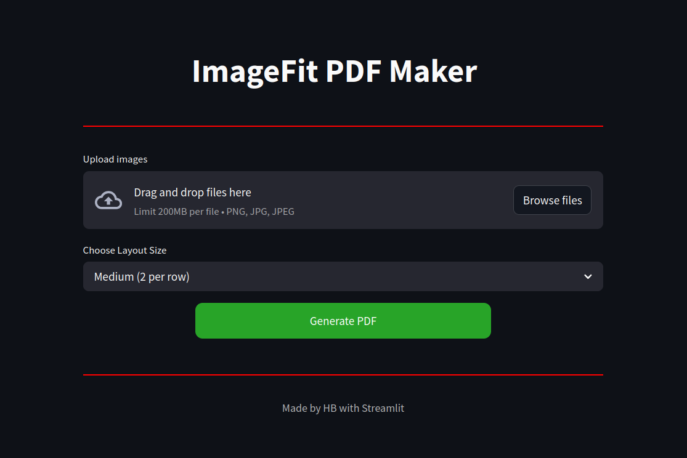
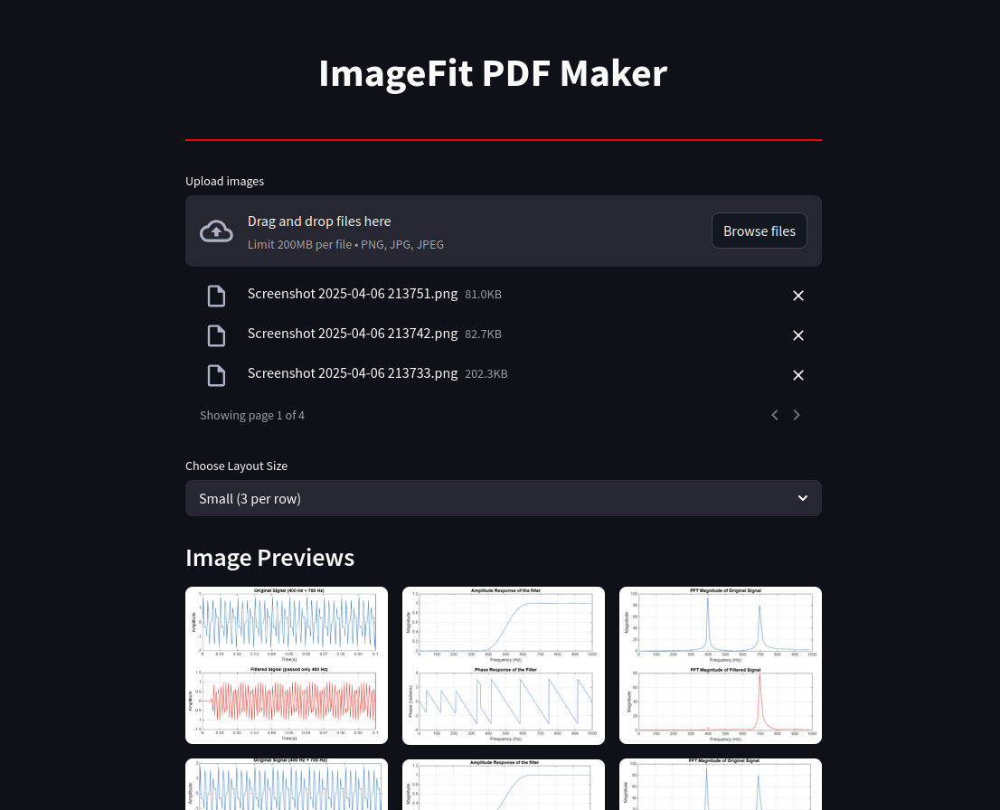
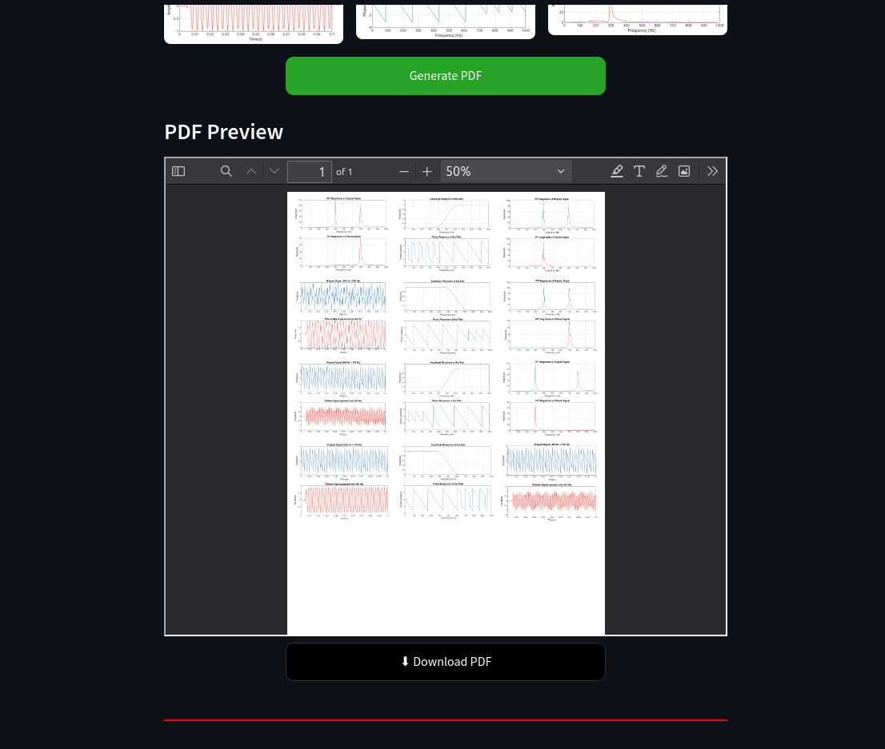

# 🖼️ ImageFit PDF Maker

A clean, fast, and mobile-friendly web app to arrange multiple images neatly on A4 pages and export them as a single print-ready PDF — built with Streamlit.

---

## Why I Built This

During lab sessions, we often had to paste multiple output screenshots or experiment results into a Word document, adjust the layout manually, and print them. This process is:

- Time-consuming  
- Paper-wasting due to excess white space  
- Repetitive and frustrating

**So I created ImageFit PDF Maker** — a streamlined tool that:

- Allows **bulk image uploads**
- **Auto-arranges images** with reduced white space
- Fits images optimally on A4 pages
- Exports them as a **printable PDF**
- Offers a clean, responsive UI

---

## Features

- Upload JPG, JPEG, and PNG files  
- Choose layout size (1–4 images per row)  
- Optimized for A4 paper format  
- Preview PDF output on desktop  
- Download-ready on mobile  
- Reduces paper wastage by minimizing white space  
- Responsive and easy-to-use interface  

---

## Live Website

👉 [Click here to try it out](https://imagefit.streamlit.app)

---

## Screenshots

Below are some usage previews of the tool:

**Upload and Layout Options**  


**Image Preview Grid**  


**PDF Output and Download**  


---

## Tech Stack

- [Streamlit](https://streamlit.io/) — Frontend + Backend UI
- [ReportLab](https://www.reportlab.com/) — PDF generation
- [Pillow (PIL)](https://python-pillow.org/) — Image handling
- Custom HTML/CSS — For UI design

---

## How to Run Locally

```bash
git clone https://github.com/your-username/imagefit-pdf-maker.git
cd imagefit-pdf-maker
pip install -r requirements.txt
streamlit run app.py
```

---

## Author

**Hrudayesh Bhaskara**  
Built to simplify lab documentation and reduce printing hassle.

📬 For suggestions, issues, or improvements — please [create an issue](https://github.com/your-username/imagefit-pdf-maker/issues) or leave a comment on the repo.

> If this project helped you, consider giving it a ⭐ on GitHub!
